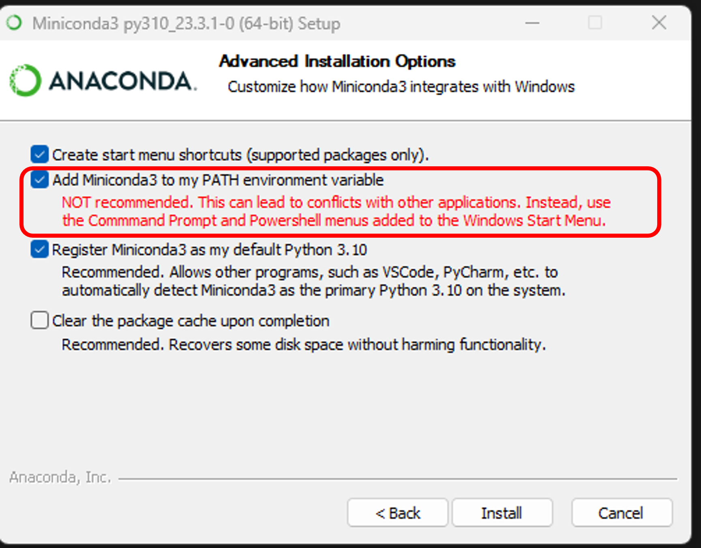
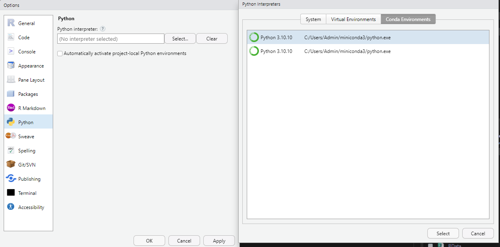
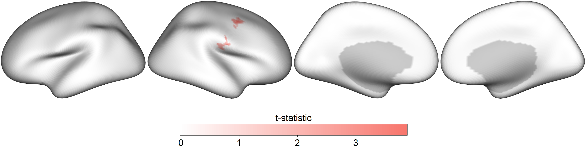
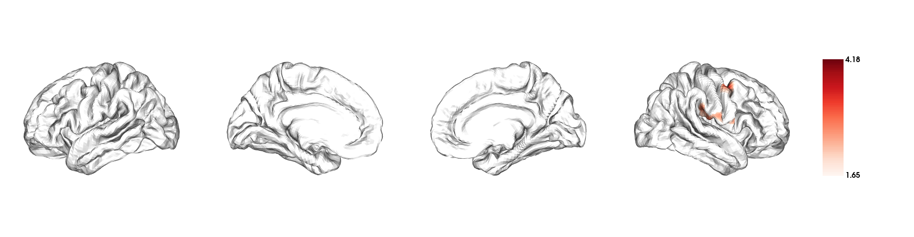
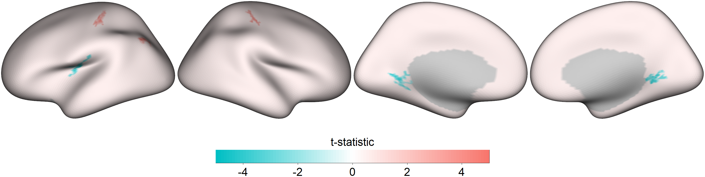
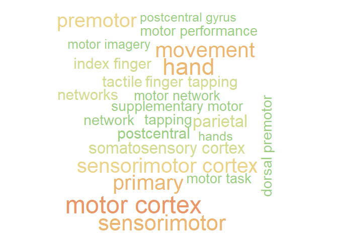

Vertex-wise R functions for analyzing and visualizing cortical thickness 
================
Cognitive and Brain Health Laboratory
2023-10-19

### Analyzing and visualzing cortical thickness

#### 1. Install miniconda

Do not start up RStudio just yet. Download and install the latest
version of miniconda from
<https://docs.conda.io/en/latest/miniconda.html> . Make sure the “Add
Miniconda3 to my PATH environment variable” option is selected during
the installation process. You can safely ignore the warning. Restart
your computer after the installation.



Open up RStudio, click `Tools > Global Options`. Under the `Python` tab,
click `Select` and choose the Conda environment that you have just
installed. Then, click `Apply`.



#### 2. Install the BrainStat python module

The [BrainStat](https://brainstat.readthedocs.io/en/master/index.html)
python module is needed for the vertex-wise analysis. This is to be
installed via the Terminal within RStudio, click on the Terminal tab
below (next to Console) and enter `python -m pip install brainstat`  
  

#### 3. Install R packages

``` r
install.packages(c("fsbrain","reticulate"))
```

  

#### 4. Download the fsaverage5 template

Download the `fsaverage5.zip` from the teams folder and unzip it and
then put the `fsaverage5` folder somewhere convenient. Avoid creating
another `fsaverage5` folder within the original `fsaverage5` folder as
you unzip the zip file  
  

### Start here when the above steps have been completed previously

#### Load R packages and custom-made R functions for vertex-wise analysis and visualization

Notice that the 4th line is not a `library()` command, instead, we are
using the `source()` command to load the custom-made R functions from
the web

``` r
library(fsbrain)
library(reticulate)
source("https://github.com/CogBrainHealthLab/VertexWiseR/blob/main/vertwise.r?raw=TRUE")
```

#### Load the datasets

``` r
dat_CT=readRDS("../data/LFC/LFC_CTv.rds") #edit path of data file accordingly
dat_beh=read.csv("../data/LFC/LFC_behdata_cleaned.csv") #edit path of data file accordingly
```

#### Preparing the model

Think of this as a multiple regression model where the DV/outcome is the
cortical thickness (CT) at each vertex, and you will decide which
IVs/predictors to enter into the model to predict the vertices’ CT. In
this example, we shall use memory scores (`RAVLT_TotLearn`),`age`,`Sex`
and `SCH` to predict CT. Among these IVs, we are mostly interested in
memory scores, the other 3 variables were merely entered into the model
to control for their confounding influence on CT.

so we pick out these 4 variables and save them into a new data.frame
called `all_pred`

``` r
all_pred=dat_beh[,c(4,5,10,69)]
head(all_pred)
```

    ##   age Sex SCH RAVLT_TotLearn
    ## 1  74   1  10             35
    ## 2  85   2  16             49
    ## 3  63   2  12             50
    ## 4  83   2  16             43
    ## 5  82   2  18             33
    ## 6  88   1  22             50

#### The actual analysis

The next code chunk runs the analysis. The second line displays the
results

``` r
results=vertex_analysis(all_predictors = all_pred, IV_of_interest =all_pred$RAVLT_TotLearn, CT_data = dat_CT)
results$cluster_level_results
```

    ## $`Positive contrast`
    ##   clusid nverts     P    X    Y    Z tstat        region
    ## 1      1     43 0.008 63.6 -7.7 32.7  3.13 rh-postcentral
    ## 2      2     36 0.021 42.7 -0.7 47.3  3.86  rh-precentral
    ## 
    ## $`Negative contrast`
    ## [1] "No significant clusters"

In the above results, the clusters that appear under the
`Positive contrast` section are clusters of vertices which correlate
positively with your `IV_of_interest`, vice-versa for the
`Negative contrast`. In this instance, there are no significant clusters
in the `Negative contrast`.

- `nverts`: number of vertices in the cluster

- `P`: p-value of the cluster

- `X, Y and Z`: MNI coordinates of the vertex with the highest t-stat in
  the cluster.

- `tstat`: t statistic of the vertex with the highest t-stat in the
  cluster

- `region`: the region this highest t-stat vertex is located in, as
  determined/labelled using the [Desikan
  atlas](https://surfer.nmr.mgh.harvard.edu/ftp/articles/desikan06-parcellation.pdf)

#### Plotting

``` r
plotCT(data = results$thresholded_tstat_map, fs_path = "../data/fsaverage5",filename = "sigcluster.png")
```

- `data`: vector of 20484 values to visualize on the cortical surface
  map

- `fs_path`: file path of your fsaverage5 folder

- `filename`: filename of the output image

 Mac users may encounter some problems running the
above code, in which case you can try the following code. The
`plotCT2()` only requires 2 parameters; it does not require the
`fs_path` parameter, because it accesses the fsaverage5 folder on the
cloud. It has very limited functionality/customization for now. I might
update this function when i figure a better way to render these cortical
surface images on MacOS

``` r
plotCT2(data = results$thresholded_tstat_map, filename = "sigcluster2.png")
```



#### Extracting the CT values for each subject

If you want to carry out some follow-up analyses (e.g., mediation), you
might want to extract, for each subject in the dataset, the mean CT in
the significant clusters colored in red (positive clusters). You can
simply do a matrix multiplication (operator for matrix multiplication :
`%*%`) between the CT data `dat_CT` and the positive mask
`results$pos_mask` . A mask in the context of brain images refers to a
vector of 1s and 0s. In this case, the vertices which are within the
significant clusters are coded as 1s, vertices outside these significant
clusters are coded as 0s. `sum(results$pos_mask)` gives you the sum of
all the 1s, which essentially is the number of significant vertices.
Thus, the `dat_CT %*% results$pos_mask` is divided by
`sum(results$pos_mask)` to obtain an average CT value. This average CT
is saved into a new variable `sig_avCT` within the `dat_beh` dataframe.

``` r
dat_beh$sig_avCT=dat_CT %*% results$pos_mask/sum(results$pos_mask)
head(dat_beh$sig_avCT)
```

    ##          [,1]
    ## [1,] 2.325544
    ## [2,] 2.448439
    ## [3,] 2.209792
    ## [4,] 2.376455
    ## [5,] 2.271535
    ## [6,] 2.203959

as a sanity check, these mean CT values should correlate with
`RAVLT_TotLearn`

``` r
cor.test(dat_beh$sig_avCT,dat_beh$RAVLT_TotLearn)
```

    ## 
    ##  Pearson's product-moment correlation
    ## 
    ## data:  dat_beh$sig_avCT and dat_beh$RAVLT_TotLearn
    ## t = 6.3175, df = 265, p-value = 1.118e-09
    ## alternative hypothesis: true correlation is not equal to 0
    ## 95 percent confidence interval:
    ##  0.2527221 0.4617816
    ## sample estimates:
    ##       cor 
    ## 0.3617917


## Image decoding
### Introduction

After running the whole-brain vertex-wise analyses, you may be able to
identify regions in the brain in which cortical thickness (CT) values
are significantly different between groups or these CT values predict a
certain IV significantly. How do we make sense of these regions? We can
plot out the results using the `plotCT()` function, but still, it may be
difficult to interpret the results in terms of the functional relevance
of the regions identified. So here’s a tool you can use to facilitate
such interpretations.

What this tool does is to correlate your input image (cortical surface
maps obtained from an earlier vertex-wise analysis) with images from a
large database of task-based fMRI and voxel-based morphometric studies.
Each of these images in the database is tagged with a few keywords,
describing the task and/or sample characteristics. The correlations that
are carried out essentially measure how similar your input image is to
each of the images in the database. Higher correlations would mean that
your input image looks very similar to a certain image in the database,
thus the keywords associated with that image in the database would be
highly relevant to your input image.

In this worked example, we will first run a whole-brain vertex-wise
analysis to compare the cortical thickness between males and females in
the young adult population of the SPRENG dataset. The thresholded
cortical surface maps obtained from this analysis will then be fed into
an image-decoding procedure to identify keywords that are relevant to
our results

### Install the NiMARE python module

The [NiMARE](https://nimare.readthedocs.io/en/stable/index.html) python
module is needed in order for the imaging decoding to work. This is to
be installed via the Terminal within RStudio, click on the Terminal tab
below (next to Console) and enter `python -m pip install nimare`

### Load R packages

``` r
library(reticulate)
library(fsbrain)
library(label4MRI)
source("https://github.com/CogBrainHealthLab/VertexWiseR/blob/main/vertwise.r?raw=TRUE")
```

### Load and prepare data

``` r
dat_beh0=read.csv("../data/SPRENG/SPRENG_behdata_cleaned.csv")
dat_CT0=readRDS("../data/SPRENG/SPRENG_CTv.rds")

#filter out old participants

dat_beh=dat_beh0[dat_beh0$agegroup=="Y",]
dat_CT=dat_CT0[dat_beh0$agegroup=="Y",]

remove(dat_beh0, dat_CT0)

##recoding categorical variables into numeric form for the vertex-wise analysis
dat_beh$sex_recode=0
dat_beh$sex_recode[dat_beh$gender=="F"]=1
all_pred=dat_beh[,c(3,7,72)]

head(all_pred)
```

    ##    site age sex_recode
    ## 1     1  21          1
    ## 15    1  32          0
    ## 16    1  20          0
    ## 17    1  21          0
    ## 18    1  24          0
    ## 19    1  20          0

### Vertex-wise analysis

``` r
results=vertex_analysis(all_predictors = all_pred, IV_of_interest =all_pred$sex_recode, CT_data = dat_CT)
results$cluster_level_results
```

    ## $`Positive contrast`
    ##   clusid nverts     P     X     Y    Z tstat        region
    ## 1      1     46 0.001 -48.4 -30.2 57.1  3.74 Postcentral_L
    ## 2      2     29 0.022  45.9 -25.1 63.7  3.91 Postcentral_R
    ## 3      3     30 0.026 -38.8 -72.8 48.0  4.34     Angular_L
    ## 
    ## $`Negative contrast`
    ##   clusid nverts     P     X     Y    Z tstat    region
    ## 1      1     56 <.001 -38.0 -13.8 18.1 -4.95  Insula_L
    ## 2      2     52 <.001  20.2 -48.3 -3.8 -3.79 Lingual_R
    ## 3      3     48 0.001 -19.7 -52.6 -1.8 -3.87 Lingual_L

``` r
plotCT(data = results$thresholded_tstat_map, fs_path = "../data/fsaverage5",filename = "sexdiff.png")
```



According to these results, since the female sex is coded as 1 and males
as 0, the regions colored in red are thicker in females, whereas those
colored in cyan are thicker in males

### Image decoding

now lets enter the `thresholded_tstat_map` into the `decode_img()`
function. Take note, the previous results contained both positive and
negative clusters, so we will need to choose either, but not both, to
decode. In this instance, we will decode the positive cluster (i.e.,
thicker in females), by setting `contrast="positive"`.

If you are running this for the first time, a ~9 MB file
`neurosynth_dataset.pkl.gz` will be downloaded to your current
directory. This file will contain the images from the
[Neurosynth](https://neurosynth.org/) database that will be correlated
with your input image.

``` r
keywords=decode_img(img=results$thresholded_tstat_map, contrast = "positive")
```

    ## Correlating input image with images in the neurosynth database. This may take a while

``` r
keywords[1:10,]
```

    ##                 keyword     r
    ## 645               motor 0.166
    ## 855       primary motor 0.136
    ## 396              finger 0.125
    ## 647        motor cortex 0.122
    ## 462                hand 0.113
    ## 964        sensorimotor 0.108
    ## 995       somatosensory 0.103
    ## 658            movement 0.101
    ## 853             primary 0.101
    ## 965 sensorimotor cortex 0.099

The above procedure will display the top 10 keywords from images in the
database that are most highly correlated with your input image.
According to these results, you can see that positive clusters (which
are thicker in females) are typically found to be associated with motor
and somatosensory processing. If you simply run `keyword` without
specifying the index within the square brackets `[1:10,]`. All 1199
keywords will be displayed.

In your presentation slides or results section of your paper, you might
want to illustrate these keywords using a wordcloud. You can set the
size of the keyword to vary according to its r value

``` r
#install.packages("wordcloud","paletteer")
library(wordcloud)
```

    ## Loading required package: RColorBrewer

``` r
library(paletteer)

wordcloud(words = keywords$keyword, ##keyword input
          freq = keywords$r, ##setting the size of the keyword to vary with its r value
          min.freq = 0.05, ##minimum r value in order for the keyword to be displayed
          colors=paletteer_c("grDevices::Temps", 10) ##color scheme
          ) 
```

<!-- -->

These keywords may not be very accurate but they should give you a rough
idea for interpreting your results. Take note that these keywords are
specific to the positive cluster (which are thicker in females). To
identify the keywords that are associated with the negative cluster
(which are thicker in males), you can repeat the above decoding
procedures while setting `contrast = "negative"`.
